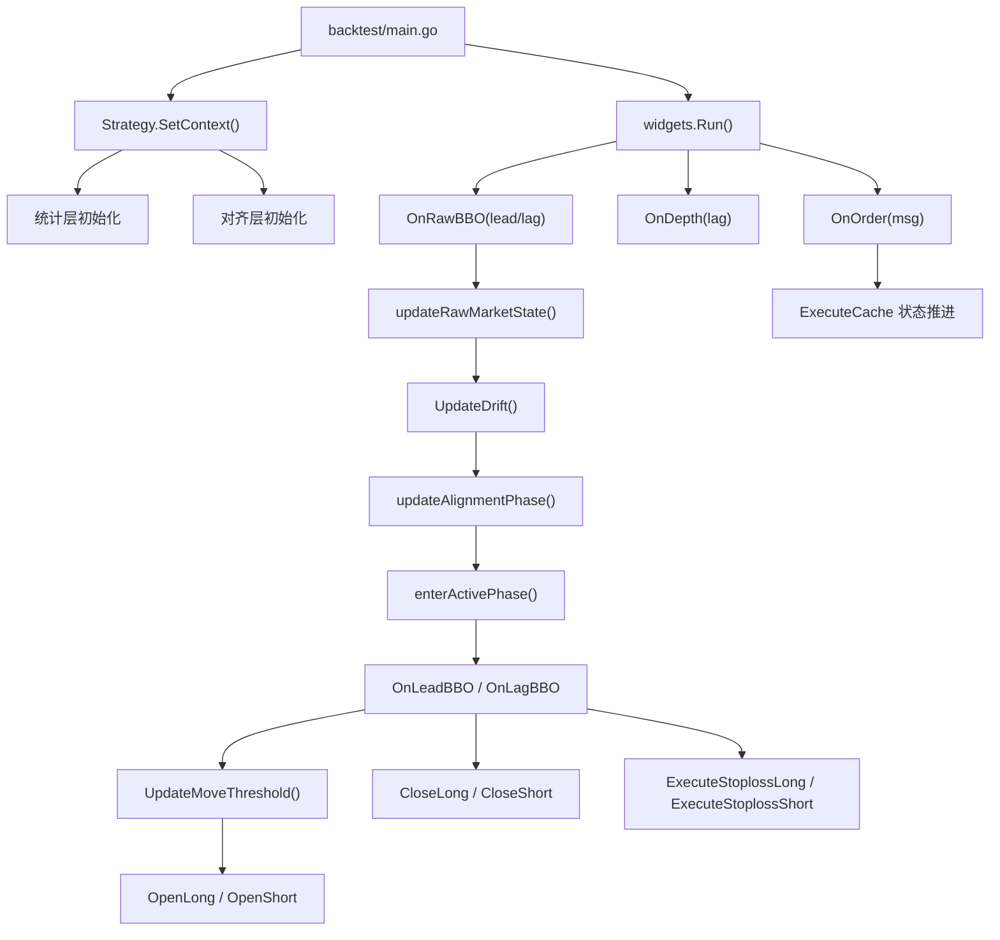
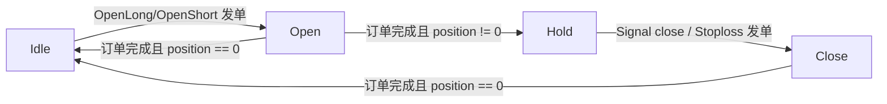

# LeadLag Fixed 策略重建手册

## 文档目标

这份文档的目标是：

- 让读者仅凭本文，就能完整复原 current fixed 版本策略
- 先看清 **整体结构与调用链**
- 再下钻到 **局部伪代码**
- 最后通过 **公式表 / 变量索引表** 精确回查每个量的定义、来源、使用位置和经济意义

本文刻意采用“**先整体，再局部**”的组织方式，不把解释拆碎到每段代码旁边。

适用对象：

- 需要跨语言重写策略的人
- 想完整理解 current fixed 执行链条的人
- 需要核对某个变量、阈值、统计器的人

本文依据：

- [LEADLAG_BACKTEST_GUIDE_FIXED.md](/Users/yukio/Desktop/Cursor%20Projects/reserch/backtest-go/LEADLAG_BACKTEST_GUIDE_FIXED.md)
- `temp/backtest-compare-2026022600-2026022702/strategy-fixed.json`
- `.wt-invariant-strategy-leadlag-must-fix/leadlag/algo/*.go`

---

## 1. 当前策略配置快照

本文以 current fixed 的常用 long-window 配置为准：

文件：
- `/Users/yukio/Desktop/Cursor Projects/reserch/backtest-go/temp/backtest-compare-2026022600-2026022702/strategy-fixed.json`

```json
{
  "symbol": "eth_usdt",
  "lead": "binance",
  "lag": "gateio",
  "trigger": {
    "lead": 0.0025,
    "close": 0.0005,
    "lag_part": 0.5,
    "quantile": { "move": 0.75 },
    "target_profit_rate": 0.0,
    "drift_limit": 0.02,
    "drift_period": "1m",
    "drift_min_samples": 20,
    "drift_warmup": "30s"
  },
  "execute": {
    "open": "100",
    "trailing_stop": 0.01,
    "max_entry_spread": 0.01,
    "parallel": 1
  },
  "bbo_record": {
    "window": "1s",
    "stats_window": "30s",
    "size": 100
  }
}
```

### 直接含义

- 交易对：`eth_usdt`
- lead：`binance`
- lag：`gateio`
- 对齐激活门槛：
  - `drift_min_samples = 20`
  - `drift_warmup = 30s`
- 开仓前 spread 上限：
  - `max_entry_spread = 1%`
- 持仓 trailing stop：
  - `trailing_stop = 1%`
- 并发持仓数：
  - `parallel = 1`
- 波动率窗口：
  - `window = 1s`
  - `stats_window = 30s`

---

## 2. 策略全景

### 2.1 一句话概括

这是一个 **只在 lag 交易所下 IOC 限价单的 lead-lag 收敛策略**：

1. 先积累 raw lead / raw lag BBO
2. 用 `lag_mid / lead_mid` 建立 drift 对齐
3. 只有对齐阶段进入 `Active` 后，才开始进行信号判断
4. 若 lead 明显先动、lag 尚未跟上、理论利润空间够、lag 当前价差不过宽，则在 lag 开仓
5. 若价差收敛或 trailing stop 触发，则在 lag 平仓

### 2.2 策略分层

当前 fixed 最好分成 5 层理解：

1. **配置层**
   - `StrategyConfig`
   - `TriggerConfig`
   - `ExecutionConfig`
   - `BBORecord`
2. **统计层**
   - `BBOVolRecorder`
   - `StreamRecorder`
   - `StreamStdEmaRecorder`
   - `MoveQueue`
3. **对齐层**
   - `UpdateDrift`
   - `alignmentReady`
   - `AlignmentPhase`
   - `enterActivePhase`
4. **交易层**
   - `OnLeadBBO`
   - `UpdateMoveThreshold`
   - `OpenLong`
   - `OpenShort`
   - `OnLagBBO`
   - `CloseLong`
   - `CloseShort`
   - `ExecuteStoplossLong`
   - `ExecuteStoplossShort`
5. **状态机层**
   - `ExecuteCache`
   - `OnOrder`

---

## 3. 模块职责图



### 模块职责摘要

| 模块 | 职责 |
|---|---|
| `backtest/main.go` | 装载配置、创建策略、启动事件循环 |
| `SetContext()` | 初始化 recorder、threshold seed、alignment 初始状态 |
| `OnRawBBO()` | 行情主入口，先 raw state，再 drift，再 alignment，再分发交易逻辑 |
| `UpdateDrift()` | 更新 drift mean / std 和 driftSamples |
| `enterActivePhase()` | 第一次进入 Active 时重新播种交易侧统计器 |
| `OnLeadBBO()` | lead 侧交易主逻辑：更新阈值、先平仓、再尝试开仓 |
| `OnLagBBO()` | lag 侧持仓管理主逻辑：spread / noise 更新、trailing stop、signal close |
| `UpdateMoveThreshold()` | 滚动更新 `UpEntry/DownEntry/UpExit/DownExit` |
| `OpenLong/OpenShort()` | 开仓判断链条 |
| `CloseLong/CloseShort()` | 信号平仓 |
| `ExecuteStoploss*()` | trailing stop |
| `OnOrder()` | 订单回报与状态机推进 |

---

## 4. 核心状态结构

### 4.1 `leadContext`

| 字段 | 含义 |
|---|---|
| `origin` | 最新 raw lead BBO |
| `prevOrigin` | 上一个 raw lead BBO |
| `drifted` | 经过 drift 缩放后的 lead BBO |
| `recorder` | lead 侧滚动 min/max bid/ask |
| `volema` | lead 侧归一化波动率 |
| `move` | lead move 分布收集器 |

### 4.2 `lagContext`

| 字段 | 含义 |
|---|---|
| `bbo` | 最新 raw lag BBO |
| `prevBBO` | 上一个 raw lag BBO |
| `recorder` | lag 侧滚动 min/max bid/ask |
| `drift` | `lag_mid / lead_mid` 的 rolling mean / std |
| `driftReady` | drift 是否已建立 |
| `spread` | lag spread 的 rolling mean |
| `volema` | lag 侧归一化波动率 |
| `depth` | lag 深度快照 |
| `fee` | lag taker fee |

### 4.3 `threshold`

| 字段 | 含义 |
|---|---|
| `UpEntry` / `DownEntry` | 动态开仓阈值 |
| `UpExit` / `DownExit` | 动态平仓阈值 |
| `LeadNoise` | lead 归一化波动率 |
| `LagNoise` | lag 归一化波动率 |
| `DriftStdEma` | drift std 的 rolling mean |

### 4.4 `alignment`

| 字段 | 含义 |
|---|---|
| `phase` | `Bootstrap / Aligning / Active` |
| `driftSamples` | 已累积 paired drift 样本数 |
| `firstPairedDriftTs` | 第一次 paired drift 样本的时间 |
| `resumeLeadTick` | Active 切换后是否允许恢复当前 lead tick |
| `loggedActive` | 是否已经打印 Active 切换日志 |

### 4.5 `ExecuteCache`

| 字段 | 含义 |
|---|---|
| `stage` | `Idle / Open / Hold / Close` |
| `order` | 当前挂单 |
| `position` | 当前持仓 |
| `trailing` | trailing stop 参考价 |
| `groupTag` | 交易组 ID |
| `grouping` | 本组订单集合 |

---

## 5. 主调用链伪代码

### 5.1 回测入口

```text
main():
    config = loadStrategyConfig(strategy.json)
    config.SetDefault()
    strategy = config.New()
    strategy.SetContext(ctx)
    widgets = setting.NewBackTest(strategy)
    widgets.Run()
```

### 5.2 行情入口 `OnRawBBO`

```text
OnRawBBO(bbo):
    # 每笔 raw BBO 都先进入这里；交易逻辑不会直接从其它入口开始
    return BBO to pool at end
    count BBO

    exchange = bbo.exchange
    prevLead = leadContext.origin
    prevLag  = lagContext.bbo

    # 先更新 raw lead/raw lag 最新状态；这里只有“记状态”，还不交易
    priceChanged, tracked = updateRawMarketState(bbo, exchange)
    if not tracked:
        return

    now = Context.Now()

    # 只要两边 raw BBO 都有效，就持续积累 drift 样本
    if raw lead valid and raw lag valid:
        UpdateDrift(now, leadContext.origin, lagContext.bbo)

    prevPhase = alignment.phase
    phase = updateAlignmentPhase(now)

    # 没进入 Active 之前，只允许积累 raw/drift，不允许推进交易链路
    if phase in [Bootstrap, Aligning]:
        return

    # 第一次进入 Active 时，重播种交易侧 recorder，避免未对齐样本污染交易阈值
    if phase == Active and prevPhase != Active:
        choose leadSeed / lagSeed
        alignment.resumeLeadTick = (exchange != lead)
        enterActivePhase(now, leadSeed, lagSeed)
        logAlignmentTransition(now)

    # Active 切换当下，如果当前 tick 不适合恢复，就直接跳过
    allowResumeLead = (exchange == lead and alignment.resumeLeadTick)
    if !priceChanged and prevPhase == Active and !allowResumeLead:
        return

    if allowResumeLead:
        alignment.resumeLeadTick = false

    # 进入真正的交易主链路
    if exchange == lead:
        ActiveLeadTicks++
        OnLeadBBO(bbo)
    else if exchange == lag:
        ActiveLagTicks++
        OnLagBBO(bbo)
```

### 5.3 交易主入口 `OnLeadBBO`

```text
OnLeadBBO(lead_bbo):
    # 保存 raw lead 快照，供 drift 和 trigger 日志复用
    leadContext.origin = lead_bbo

    # 只有 driftReady 之后，才把 lead 价格缩放到 lag 坐标系
    if driftReady:
        drift = lagContext.drift.GetMean()
        lead_bbo.ask *= drift
        lead_bbo.bid *= drift
    else:
        drift = 1

    leadContext.drifted = lead_bbo

    # 更新 lead 侧统计器：极值窗口、波动率、阈值滚动
    leadContext.recorder.OnBBO(...)
    leadContext.volema.OnData(...)
    UpdateMoveThreshold(now, lead_bbo)

    # 先处理已有仓位的平仓；固定优先级：平仓 > 开仓
    for each cache in caches:
        if cache.stage == Hold:
            if cache.position > 0:
                CloseLong(cache, lead_bbo, lag_bbo)
            else if cache.position < 0:
                CloseShort(cache, lead_bbo, lag_bbo)

    # 开仓总门禁：并发限制
    if len(caches) >= parallel:
        return

    # 开仓总门禁：drift 偏离太大则不新开仓，但统计链路依然继续
    if driftReady and abs(drift-1) > drift_limit:
        return

    OpenChecks++

    # 开仓顺序固定：先尝试 long，再尝试 short
    if OpenLong(lead_bbo):
        return
    OpenShort(lead_bbo)
```

### 5.4 持仓管理入口 `OnLagBBO`

```text
OnLagBBO(lag_bbo):
    # lag 侧 tick 是持仓管理主驱动：spread、noise、stoploss、signal close 都在这里推进
    lagContext.recorder.OnBBO(...)
    lagContext.spread.OnData(...)
    lagContext.volema.OnData(...)
    lagContext.bbo = lag_bbo

    for each cache in caches:
        if cache.stage == Hold:
            if cache.position > 0:
                # long：先更新 trailing 高点，再尝试止损，再尝试信号平仓
                TrackLogTrailingLong(cache, lag_bbo)
                if ExecuteStoplossLong(cache, lag_bbo):
                    continue
                CloseLong(cache, lead_drifted, lag_bbo)
            else if cache.position < 0:
                # short：先更新 trailing 低点，再尝试止损，再尝试信号平仓
                TrackLogTrailingShort(cache, lag_bbo)
                if ExecuteStoplossShort(cache, lag_bbo):
                    continue
                CloseShort(cache, lead_drifted, lag_bbo)
```

### 5.5 阶段切换 `enterActivePhase`

```text
enterActivePhase(now, leadSeed, lagSeed):
    # 重新初始化“交易侧”的 recorder；对齐阶段积累的 raw/drift 状态不直接复用
    re-init lead recorder
    re-init lag recorder
    re-init lead volema
    re-init lag volema
    re-init lag spread
    re-init move queue

    # 如果 drift 已经建立，则播种前先缩放 leadSeed
    if driftReady:
        scale leadSeed by drift mean

    # 用当前快照给交易侧 recorder 一个干净起点
    seed lead recorder / lead volema
    seed lag recorder / lag spread / lag volema
```

---

## 6. 开仓 / 平仓 / 止损伪代码

### 6.1 `UpdateMoveThreshold`

```text
UpdateMoveThreshold(now, lead_bbo):
    if MoveQueue.ShouldRoll(now):
        # 滚动时先冻结本窗口内的噪声和 move 分布
        LeadNoise = lead_volema.GetStdEma()
        LagNoise  = lag_volema.GetStdEma()

        sort move queue
        up   = quantile(Up, quantile.move)
        down = quantile(Down, 1 - quantile.move)
        exit = DriftStdEma.GetMean()

        # 当前 fixed 的显式成本预算：fee + lead noise + lag noise
        profitBuffer = fee*2 + LeadNoise + LagNoise

        # 上行阈值：如果 quantile 本身已高于 exit+成本，就直接用 quantile；否则用 exit+成本兜底
        if up - exit > profitBuffer:
            UpEntry = up
            UpExit  = exit
        else:
            UpEntry = exit + profitBuffer
            UpExit  = exit

        # 下行阈值：与上行对称
        if -down - exit > profitBuffer:
            DownEntry = down
            DownExit  = -exit
        else:
            DownEntry = -exit - profitBuffer
            DownExit  = -exit

        MoveQueue.Roll(now)

    # 无论是否滚动，当前 tick 都会继续被推进 move 分布，供下一个 stats_window 使用
    bidMin = lead recorder bid min
    askMax = lead recorder ask max
    MoveQueue.Push(
        lead_bid / bidMin - 1,
        lead_ask / askMax - 1
    )
```

### 6.2 `OpenLong`

```text
OpenLong(lead_bbo):
    # 先从 lead recorder 拿到当前窗口低点，作为 move 的比较基准
    leadBase = lead recorder bid min
    minAsk   = lead recorder ask min

    leadMove = lead_bid / leadBase - 1
    askDiff  = lead_ask / minAsk - 1

    # 当前 lead bid 必须已经在 lag ask 上方，否则还谈不上 lead 领先
    trigPrice = lag ask
    prcDiff   = lead_bid / lag_ask - 1
    if prcDiff <= 0:
        reject

    # 第一层：lead 两边报价都要足够强
    if leadMove >= UpEntry and askDiff >= UpEntry:
        UpLeadCount++

        # 第二层：lag 还没把 lead 的动作跟完
        lagBase   = min(lead bid min, lag bid min)
        lagMove   = lag_bid / lagBase - 1
        moveSpace = leadMove - lagMove

        if moveSpace / leadMove > lag_part:
            UpLadCount++

            # 第三层：假设未来回归到 UpExit，计算理论利润空间
            targetPrice = lead_bid - lead_bid * UpExit - LagSpreadBuffer
            targetSpace = targetPrice / lag_ask - 1

            # 第四层：理论利润空间必须覆盖显式成本和额外利润要求
            entryCost    = BuildEntryCostBreakdown(lag_bbo, lag_ask)
            requiredEdge = entryCost.RequiredEdgeWithTargetProfit(target_profit_rate)

            if targetSpace < requiredEdge:
                reject

            # 第五层：lag 当前盘口不能太宽
            if spreadPct(lag_bbo) > EntrySpreadLimit():
                reject

            UpSpaceCount++
            # 通过全部过滤后，才真正发 IOC 买单
            build IOC long on lag ask
            RecordTrigger(...)
            SendOrder(...)
            Stage = Open
            return true

    return false
```

### 6.3 `OpenShort`

```text
OpenShort(lead_bbo):
    # 空头逻辑与多头镜像，基准换成当前窗口高点
    leadBase = lead recorder ask max
    maxBid   = lead recorder bid max

    leadMove = lead_ask / leadBase - 1
    bidDiff  = lead_bid / maxBid - 1

    # 当前 lead ask 必须已经压到 lag bid 下方
    trigPrice = lag bid
    prcDiff   = lead_ask / lag_bid - 1
    if prcDiff >= 0:
        reject

    # 第一层：lead 两边报价都要足够弱
    if leadMove <= DownEntry and bidDiff <= DownEntry:
        DownLeadCount++

        # 第二层：lag 还没完全跟跌
        lagBase   = max(lead ask max, lag ask max)
        lagMove   = lag_ask / lagBase - 1
        moveSpace = leadMove - lagMove

        if moveSpace / leadMove >= lag_part:
            DownLadCount++

            # 第三层：按 DownExit 假设未来回归，计算理论利润空间
            targetPrice = lead_ask - leadBase * DownExit + LagSpreadBuffer
            targetSpace = targetPrice / lag_bid - 1

            # 第四层：利润空间必须覆盖显式成本和额外利润要求
            entryCost    = BuildEntryCostBreakdown(lag_bbo, lag_bid)
            requiredEdge = entryCost.RequiredEdgeWithTargetProfit(target_profit_rate)

            if -targetSpace < requiredEdge:
                reject

            if spreadPct(lag_bbo) > EntrySpreadLimit():
                reject

            DownSpaceCount++
            # 通过全部过滤后，才真正发 IOC 卖空单
            build IOC short on lag bid
            RecordTrigger(...)
            SendOrder(...)
            Stage = Open
            return true

    return false
```

### 6.4 `CloseLong`

```text
CloseLong(cache, lead_bbo, lag_bbo):
    # 如果还有未完成订单，不重复发 close 单
    if cache has pending order:
        return

    # 观察 drifted lead 与 lag bid 的相对价差是否已回归到 UpExit 以下
    lagDiff = lead_bid / lag_bid - 1
    if lagDiff < UpExit:
        build IOC short close at lag bid
        RecordTrigger(...)
        SendOrder(...)
        Stage = Close
```

### 6.5 `CloseShort`

```text
CloseShort(cache, lead_bbo, lag_bbo):
    # 如果还有未完成订单，不重复发 close 单
    if cache has pending order:
        return

    # 观察 drifted lead 与 lag ask 的相对价差是否已回归到 DownExit 以上
    lagDiff = lead_ask / lag_ask - 1
    if lagDiff > DownExit:
        build IOC long close at lag ask
        RecordTrigger(...)
        SendOrder(...)
        Stage = Close
```

### 6.6 `ExecuteStoplossLong`

```text
ExecuteStoplossLong(cache, lag_bbo):
    # 有挂单时不重复止损
    if cache has pending order:
        return false

    # trailing_high 是 long 持仓期间见过的最高 lag bid
    fallback = lag_bid / trailing_high - 1
    if fallback <= -trailing_stop:
        # 止损单价格更激进，目的是尽快平掉
        build aggressive IOC short close at lag_bid * 0.995
        RecordTrigger(by='sl')
        SendOrder(...)
        Stage = Close
        return true
    return false
```

### 6.7 `ExecuteStoplossShort`

```text
ExecuteStoplossShort(cache, lag_bbo):
    # 有挂单时不重复止损
    if cache has pending order:
        return false

    # trailing_low 是 short 持仓期间见过的最低 lag ask
    fallback = -(lag_ask / trailing_low - 1)
    if fallback <= -trailing_stop:
        # 止损单价格更激进，目的是尽快买回
        build aggressive IOC long close at lag_ask * 1.005
        RecordTrigger(by='sl')
        SendOrder(...)
        Stage = Close
        return true
    return false
```

---

## 7. 订单与状态机伪代码

### 7.1 `OnOrder`

```text
OnOrder(msg):
    # 先按 ClientID 找回所属 ExecuteCache
    find cache by ClientID
    update order filled qty / status / avg fill price

    if order finished:
        # finished 才把这笔订单写入 grouping，供后续收益分析器拼接 round trip
        append order to grouping
        record order log

        # 先把 filled qty 归整到交易所合法步进
        filled = GetOrderFilled(order)

        # 再按 side 改 position
        if side == Long:
            position += filled
        else:
            position -= filled

        # position 清零表示这笔仓位已经完整结束
        if position == 0:
            Stage = Idle
            delete cache
        else:
            # 开仓单首次完成时，用成交均价初始化 trailing 参考价
            if Stage == Open and avg_fill_price > 0:
                trailing = avg_fill_price
            Stage = Hold

        # 清掉 pending order，允许后续再发 close / stoploss 单
        clear pending order
```

### 7.2 `ExecuteCache` 状态转移



### 7.3 数量计算

#### `CalOpenQty`

```text
raw_qty = open_notional / order_price
formatted_qty =
    round(raw_qty / quantity_tick / contract_value)
    * quantity_tick
    * contract_value
```

#### `GetOrderFilled`

```text
filled =
    round(filled_qty / tick / contract_value)
    * tick
    * contract_value
```

作用：

- 保证仓位数量与交易所步进一致
- 避免浮点误差留下微小残仓

---

## 8. 公式总表

| 名称 | 公式 | 在哪算 | 用来干什么 |
|---|---|---|---|
| `drift` | `(lag_ask + lag_bid) / (lead_ask + lead_bid)` | `UpdateDrift()` | lead 对齐到 lag 坐标系 |
| `drift std` | `sqrt(E[x²] - E[x]²)` | `StreamRecorder.GetStd()` | drift 波动度 |
| `LeadNoise` | `rolling_mean(std(lead_mid_window)/mean(lead_mid_window))` | `StreamStdEmaRecorder` | lead 显式成本项 |
| `LagNoise` | `rolling_mean(std(lag_mid_window)/mean(lag_mid_window))` | `StreamStdEmaRecorder` | lag 显式成本项 |
| `up` | `quantile(Up, quantile.move)` | `UpdateMoveThreshold()` | 上行 entry 候选阈值 |
| `down` | `quantile(Down, 1-quantile.move)` | `UpdateMoveThreshold()` | 下行 entry 候选阈值 |
| `exit` | `DriftStdEma.GetMean()` | `UpdateMoveThreshold()` | 回归型 exit 阈值 |
| `profitBuffer` | `fee*2 + LeadNoise + LagNoise` | `ProfitBuffer()` | 显式成本预算 |
| `Spread` | `2*(ask-bid)/(ask+bid)` | `spreadPct()` | lag 当前盘口宽度 |
| `LagSpreadBuffer` | `max(current_spread - mean_spread, 0)` | `LagSpreadBuffer()` | 当前 spread 超额宽度 |
| `leadMove` | long: `lead_bid / lead_bid_min - 1`；short: `lead_ask / lead_ask_max - 1` | `OpenLong/Short()` | lead 侧主移动量 |
| `askDiff` | `lead_ask / lead_ask_min - 1` | `OpenLong()` | long 辅助确认 |
| `bidDiff` | `lead_bid / lead_bid_max - 1` | `OpenShort()` | short 辅助确认 |
| `prcDiff` | long: `lead_bid / lag_ask - 1`；short: `lead_ask / lag_bid - 1` | `OpenLong/Short()` | 当前是否已跨过 lag 对手价 |
| `lagMove` | long: `lag_bid / min(lead_bid_min,lag_bid_min) - 1`；short: `lag_ask / max(lead_ask_max,lag_ask_max) - 1` | `OpenLong/Short()` | lag 跟随程度 |
| `moveSpace` | `leadMove - lagMove` | `OpenLong/Short()` | 剩余领先空间 |
| `targetPrice` | long: `lead_bid - lead_bid*UpExit - LagSpreadBuffer`；short: `lead_ask - leadBase*DownExit + LagSpreadBuffer` | `OpenLong/Short()` | 假设回归后的目标价格 |
| `targetSpace` | long: `targetPrice / lag_ask - 1`；short: `targetPrice / lag_bid - 1` | `OpenLong/Short()` | 理论利润空间 |
| `RequiredEdge` | `Fee + LeadNoise + LagNoise` | `EntryCostBreakdown` | 显式门槛 |
| `EntrySpreadLimit` | `max_entry_spread` or fallback `trailing_stop` | `ExecutionConfig.EntrySpreadLimit()` | lag spread 过滤上限 |
| `fallback` | long: `lag_bid / trailing_high - 1`；short: `-(lag_ask / trailing_low - 1)` | `ExecuteStoploss*()` | trailing stop 回撤比例 |

---

## 9. 函数索引表

| 函数 | 输入 | 输出 | 读取的关键状态 | 写入的关键状态 | 依赖参数 | 作用 |
|---|---|---|---|---|---|---|
| `SetContext` | `ctx` | 无 | `config` | 初始化 `leadContext` / `lagContext` / `threshold` / `alignment` | `bbo_record.*`, `trigger.*`, `execute.*` | 启动前初始化全部 recorder 和 seed |
| `OnRawBBO` | `bbo` | `error` | raw state, alignment state | raw state, drift, alignment | `drift_min_samples`, `drift_warmup` | 行情主入口 |
| `updateRawMarketState` | `bbo`, `exchange` | `priceChanged`, `tracked` | raw lead/raw lag | raw lead/raw lag | `lead`, `lag` | 更新 raw 快照并过滤重复价 |
| `UpdateDrift` | `now`, `leadBBO`, `lagBBO` | 无 | lead/lag BBO | `lagContext.drift`, `driftReady`, `driftSamples`, `DriftStdEma` | `drift_period` | 更新 drift mean/std |
| `alignmentReady` | `now` | `bool` | raw lead/raw lag, `driftSamples`, `firstPairedDriftTs` | 无 | `drift_min_samples`, `drift_warmup`, `stats_window` | 判断能否进入 Active |
| `updateAlignmentPhase` | `now` | `phase` | raw state, `alignmentReady` | `alignment.phase` | 同上 | 更新当前 phase |
| `enterActivePhase` | `now`, `leadSeed`, `lagSeed` | 无 | drift mean, seeds | 重置并播种交易侧 recorder | `bbo_record.window`, `bbo_record.stats_window` | Active 初始化 |
| `OnLeadBBO` | `lead_bbo` | `error` | drift, caches, lag BBO | lead recorder, lead noise, threshold, counters | `parallel`, `drift_limit` | lead 侧交易主逻辑 |
| `OnLagBBO` | `lag_bbo` | `error` | caches, lead_drifted | lag recorder, lag spread, lag noise | `trailing_stop` | lag 侧持仓管理 |
| `UpdateMoveThreshold` | `now`, `lead_bbo` | 无 | move queue, lead/lag noise, drift std EMA | `UpEntry`, `DownEntry`, `UpExit`, `DownExit` | `quantile.move`, `target_profit_rate` | 滚动更新阈值 |
| `OpenLong` | `lead_bbo` | `bool`, `error` | lead/lag recorder, lag BBO, threshold | counters, caches, order | `lag_part`, `target_profit_rate`, `max_entry_spread` | long 开仓判断与发单 |
| `OpenShort` | `lead_bbo` | `bool`, `error` | lead/lag recorder, lag BBO, threshold | counters, caches, order | 同上 | short 开仓判断与发单 |
| `CloseLong` | `cache`, `lead_bbo`, `lag_bbo` | `error` | threshold, lag BBO, cache | order, stage | `UpExit` | long 信号平仓 |
| `CloseShort` | `cache`, `lead_bbo`, `lag_bbo` | `error` | threshold, lag BBO, cache | order, stage | `DownExit` | short 信号平仓 |
| `ExecuteStoplossLong` | `cache`, `lag_bbo` | `bool`, `error` | cache.trailing | order, stage | `trailing_stop` | long trailing stop |
| `ExecuteStoplossShort` | `cache`, `lag_bbo` | `bool`, `error` | cache.trailing | order, stage | `trailing_stop` | short trailing stop |
| `LagSpreadBuffer` | `lag_bbo` | `float64` | lag spread mean | 无 | `stats_window` | 计算 lag 当前额外摩擦 |
| `BuildEntryCostBreakdown` | `lag_bbo`, `triggerPrice` | `EntryCostBreakdown` | `LeadNoise`, `LagNoise`, fee, lag spread | 无 | `target_profit_rate`（后续调用） | 统一显式成本项 |
| `RecordTrigger` | cache, ts, leadBBO, lagBBO, trigger, order | 无 | lead/lag snapshot, lag depth | trigger 日志 | 无 | 写结构化 trigger 日志 |
| `OnDepth` | `depth` | `error` | lag exchange name | `lagContext.depth` | `lag` | 保存 lag 深度 |
| `CalOpenQty` | `symbol`, `price` | `float64` | `open_notional`, symbol metadata | 无 | `execute.open` | 名义金额转数量 |
| `FormatQty` | `symbol`, `rawQuantity` | `float64` | symbol tick / contract value | 无 | 无 | 数量步进格式化 |
| `GetOrderFilled` | `order` | `decimal.Decimal` | filled qty, symbol tick | 无 | 无 | 成交数量归整 |
| `OnOrder` | `msg` | `error` | cache/order | order status, position, stage | 无 | 订单回报与状态机推进 |

---

## 10. 变量索引表

| 变量 / 阈值 | 定义 / 来源 | 公式 | 使用位置 | 经济意义 |
|---|---|---|---|---|
| `leadContext.origin` | `OnRawBBO()` / `OnLeadBBO()` | raw lead BBO | drift、trigger、日志 | lead 原始快照 |
| `leadContext.drifted` | `OnLeadBBO()` / `enterActivePhase()` | raw lead × drift | signal close、日志 | 与 lag 同坐标系的 lead |
| `lagContext.bbo` | `OnRawBBO()` / `OnLagBBO()` | raw lag BBO | open、close、spread、日志 | lag 最新快照 |
| `lagContext.drift` | `UpdateDrift()` | rolling ratio recorder | drift mean / std | lead-lag 长期基差 |
| `driftReady` | `UpdateDrift()` 置 true | boolean | OnLeadBBO、alignment | 是否允许使用 drift |
| `driftSamples` | `UpdateDrift()` 自增 | integer | `alignmentReady()` | paired drift 样本数 |
| `firstPairedDriftTs` | `UpdateDrift()` 首次记录 | timestamp | `alignmentReady()` | warm-up 起点 |
| `UpEntry` / `DownEntry` | `UpdateMoveThreshold()` | 见公式总表 | `OpenLong/Short()` | 当前开仓阈值 |
| `UpExit` / `DownExit` | `UpdateMoveThreshold()` | `exit` 或 `-exit` | `CloseLong/Short()` / `targetPrice` | 当前平仓阈值 |
| `LeadNoise` | `leadContext.volema.GetStdEma()` | 见公式总表 | `ProfitBuffer()` / `EntryCost` | lead 显式噪声成本 |
| `LagNoise` | `lagContext.volema.GetStdEma()` | 见公式总表 | `ProfitBuffer()` / `EntryCost` | lag 显式噪声成本 |
| `DriftStdEma` | `threshold.DriftStdEma` | rolling mean of drift std | `UpdateMoveThreshold()` | 价差回归型 exit 锚点 |
| `leadMove` | `OpenLong/Short()` | 见公式总表 | 第一层 trigger | lead 移动幅度 |
| `askDiff` | `OpenLong()` | 见公式总表 | long 第一层 trigger | long ask 同步确认 |
| `bidDiff` | `OpenShort()` | 见公式总表 | short 第一层 trigger | short bid 同步确认 |
| `lagMove` | `OpenLong/Short()` | 见公式总表 | lag_part 过滤 | lag 跟随程度 |
| `moveSpace` | `OpenLong/Short()` | `leadMove - lagMove` | lag_part 过滤 | 可交易领先空间 |
| `targetSpace` | `OpenLong/Short()` | 见公式总表 | 成本门槛判断 | 这笔单理论还能赚多少 |
| `RequiredEdge` | `EntryCostBreakdown.RequiredEdge()` | `Fee + LeadNoise + LagNoise` | 开仓门槛 | 这笔单至少要覆盖的显式成本 |
| `Spread` | `spreadPct()` | 见公式总表 | 开仓 spread 过滤 / 日志 | lag 当前盘口宽度 |
| `LagSpreadBuffer` | `LagSpreadBuffer()` | 见公式总表 | `targetPrice` | lag 当前额外摩擦 |
| `parallel` | config | integer | `OnLeadBBO()` | 最大并发仓位 |
| `trailing_stop` | config | percentage | `ExecuteStoploss*()` | 最大允许回撤 |
| `max_entry_spread` | config | percentage | `EntrySpreadLimit()` | 开仓前 lag spread 上限 |
| `groupTag` | `OpenLong/Short()` | `CID` | `RecordTrigger()` / `OnOrder()` | 把一组开平仓日志串起来 |

---

## 11. 如果你要完整复原，建议实现顺序

1. 配置结构
2. recorder / queue
3. drift / alignment phase
4. threshold engine
5. open / close / stoploss
6. order state machine
7. logging / grouping

只要这七层都实现一致，就可以复原 current fixed 的核心行为。

---

## 12. 最后的技术总结

如果只用一句话描述 current fixed：

> 它是一个“先做 drift 对齐，再用自适应 move quantile 生成动态阈值，并用统一显式成本模型筛选 lag IOC 订单”的单腿 lead-lag 收敛策略。

而真正让它与 baseline 拉开差距的，不是单一参数，而是这四个组合：

1. `alignmentReady`
2. `driftReady`
3. `max_entry_spread` 与 `trailing_stop` 职责拆分
4. `LagNoise` 进入显式门槛
